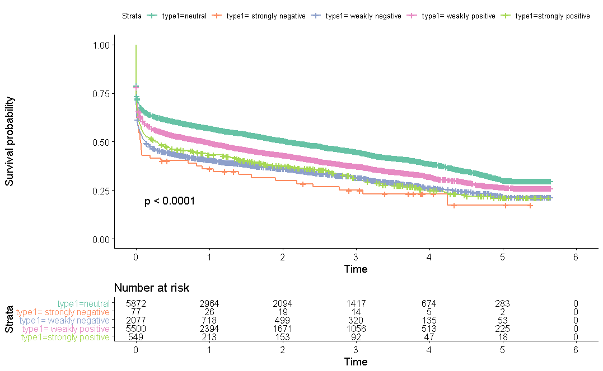

### Survival Analysis
Survival analysis which compares the probability to stay active on the forum among groups of users.  
The Cox proportional hazards regression model evaluates how different sentiment in received answers  
influence the rate of users leaving the forum or the hazard ratio (HR) of leaving the forum at a 
particular point in time. The HR indicates the increased probability of staying or leaving the forum  
in comparison the standardized group.

Survival Analysis using Cox regression results

  | --- | Β coefficient | Hazard ratio (HR) | SE | p |
  | --- | --- | --- | --- | --- |
  |  strongly negative | 0.47 | 1.60 | 0.13 | p≤0.001*** |
  | weakly negative | 0.38 | 1.46 | 0.03 | p≤0.001*** |
  | weakly positive | 0.17 | 1.18 | 0.02 | p≤0.001*** |
  | strongly positive | 0.32 | 1.38 | 0.0 | p≤0.001*** |  
  
Note: number of events= 8548, R2= 0.011, Score (logrank) test = 164.1 on 4 df, p ≤ 0.001  

As compared to users who receive neutral answers, an increased hazard ratio identified for users  
who receive answers containing sentiment. This ratio is highest in the strongly negative group  
(HR = 1.60, SE = 0.13, p < 0.0001), and lowest in the weakly positive group (HR = 1.18, SE = 0.02, p < 0.0001).
The group which receives strongly negative answers is most likely to drop out from the forum,  
with 2 users staying active after 5 years. 

### Negative Binomial Regression
As most users post only once, then leave the forum, we have not only extreme right skewed but also  
overdispersed count data distribution. We fit the hurdle negative binomial regression model with one  
logistic model for the zeros and one negative binomial model for the positive values of the dependent variable. 

Hurdle Negative binomial multiple regression with transformed post count  
Hurdle model (Binomial with logit link)

| --- | Coefficient  |	SE | p | 
| --- | --- | --- | --- |
| Constant | 	-0.13 | 	0.03 | 	<0.001*** | 
|   Mean Favorite Count	 | 0.03	 | 0.07	 | <0.001*** | 
| Mean Reply Count	 | -0.09	 | 0.04	 | <0.001*** | 
| Mean Sentiment Receive	 | 0.001	 | 0.07	 | 0.90 |  

Count model (Negative Binomial Regression)			 

| --- | Coefficient  |	SE | p | 
| --- | --- | --- | --- |
|  Constant	 | -11.16	 | 74.32 | 	0.88 | 
| Mean Favorite Count | 	0.19 | 	0.04 | 	<0.001*** | 
| Mean Reply Count	 | -0.35 | 	0.01 | 	<0.001*** | 
| Mean Sentiment Receive | 	0.05 | 	0.02 | 	<0.001*** | 

The Logistic model evaluates the effect of social support on users’ motivation to post more than once.  
The baseline odds of posting more comparing to posting only once is -0.13, which means users in general  
are more likely to post only once (SE = 0.03, p<0.001). This likelihood is increased by 0.03 times by   
one more favorite count (SE = 0.07, p<0.001) and decreased by 0.09 times by one more reply   
(SE = 0.04, p<0.001). The sentiment of the answers however does not have any significant effect on user   
decision to continue posting (p = 0.90)

Positive count model shows the effect of social support on the log of number of posts for those who post  
more than once. Both number of favorite count and sentiment in answers have a positive effect on number of  
posts (beta = 0.19, SE = 0.04, p<0.001 and beta = 0.05, SE = 0.02, p<0.001). However, number of replies  
has a negative effect on number of posts (beta = -0.35, SE = 0.01, p<0.001). 

