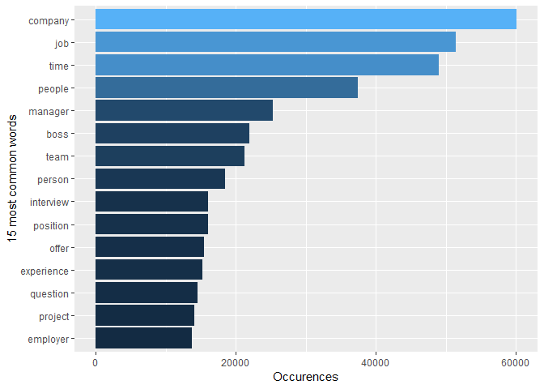
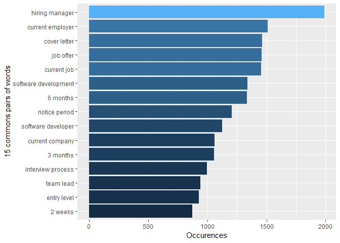
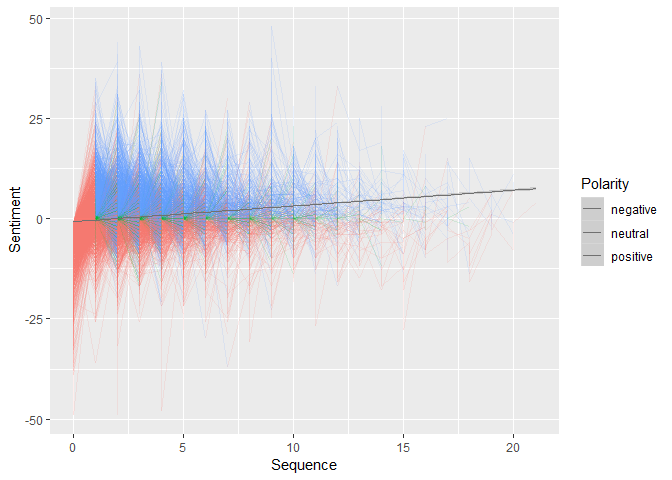

Term Frequency and Sentiment Analysis
================

Part 1. Term Frequency
======================

Term frequency is a very quick method to look at the overview of the content.

``` r
PostDataframe_td <- PostDataframe['Body']
PostDataframe_td <- PostDataframe_td %>%
  unnest_tokens(word, Body)%>%
  anti_join(stop_words, by = "word")

words_counts <- PostDataframe_td %>% 
  count(word, sort = TRUE)%>% 
  top_n(15)
```

    ## Selecting by n

``` r
ggplot(words_counts, aes(x = reorder(word, n), y = n, fill = n)) +
  geom_bar(show.legend = FALSE, stat = "identity") +
  labs(x = "15 most common words", y = "Occurences")+
  coord_flip()
```

 However, although we can find the most frequently used words are very relatabe to the Workplace topic, it's also very general words. We move on to look at the bigrams frequency for more specific topical terms. The results suggest the majority of users in the software industry, with many concerns about the job application process.

``` r
#Most common pairs of words in all posts
allposts_bigram <- PostDataframe['Body'] 

allposts_bigram <- allposts_bigram%>%
  unnest_tokens(bigram, Body, token = "ngrams", n = 2)%>%
  count(bigram, sort = TRUE)

bigrams_separated <- allposts_bigram %>%
  separate(bigram, c("word1", "word2"), sep = " ")

bigrams_filtered <- bigrams_separated %>%
  filter(!word1 %in% stop_words$word) %>%
  filter(!word2 %in% stop_words$word)

bigrams_united <- bigrams_filtered %>%
  unite(bigram, word1, word2, sep = " ")

bigrams_united <- head(bigrams_united[order(bigrams_united$n, decreasing=TRUE), ], 15)

ggplot(bigrams_united, aes(x = reorder(bigram, n), y = n, fill = n)) +
  geom_bar(show.legend = FALSE, stat="identity") +
  labs(x = "15 commons pairs of words", y = "Occurences")+
  coord_flip()
```

 We get sentiment in a (quick and dirty) way using the sentiment lexicon Bing and AFINN.

``` r
library("syuzhet")
PostDataframe$Bing <- as.numeric(get_sentiment(PostDataframe$Body, method="bing"))
PostDataframe$afinn <- as.numeric(get_sentiment(PostDataframe$Body, method="afinn"))
```

With an effort to plot all the threads as time series, starting from the question in position 0 of the sequence. The objective is to look into if the sentiment go up or down as the discussion progress as well as the frequency, streng and distribution of different sentiment.

Good news is the sentiment will always become more neutral or slightly positive as the thread progess, and strong sentiments will also diminish.

``` r
#Filter questions as posts without parenId and answer as posts with parentId
#Create sequence of post in a thread starting with 0 as the question
qSentiment <- filter(PostDataframe, is.na(ParentId))
qSentiment$Sequence = 0
aSentiment <- filter(PostDataframe, !is.na(ParentId))
aTime <- aSentiment %>% 
  group_by(ParentId) %>% 
  arrange(ParentId, CreationDate)
aTime <- aTime %>% 
  group_by(ParentId) %>% 
  mutate(Sequence = 1:n())

# Combine into dataframe with sequence
aTime <- data.frame(aTime$ParentId, aTime$Bing, aTime$afinn, aTime$Sequence, aTime$CreationDate)
qTime <- data.frame(qSentiment$Id, qSentiment$Bing, qSentiment$afinn, qSentiment$Sequence, qSentiment$CreationDate)
names(aTime)<-c("Id", "Bing_sentiment", "AFINN_sentiment","Sequence","CreationDate")
names(qTime)<-c("Id", "Bing_sentiment", "AFINN_sentiment","Sequence","CreationDate")
sentimentTime <- bind_rows(aTime, qTime)
sentimentTime <- gather(sentimentTime, "Bing_sentiment", "AFINN_sentiment", key = "SentimentLexicon", value = "Sentiment")
sentimentTime$Polarity <- as.factor(ifelse(sentimentTime$Sentiment == 0, 'neutral',ifelse(sentimentTime$Sentiment < 0, "negative","positive")))
sentimentTime$SentimentLexicon <- as.factor(sentimentTime$SentimentLexicon)
sentimentTime$Id <- as.factor(sentimentTime$Id)
# plot all threads starting with a negative question
sentimentTime_negative <- sentimentTime%>% 
  group_by(SentimentLexicon, Id) %>% 
  arrange(Id, Sequence) %>% 
  filter(first(Sentiment) < 0)

ggplot(sentimentTime_negative, aes(Sequence, Sentiment, color = Polarity)) +
  geom_line(aes(group = Id),show.legend = F, alpha = 1/8)+
  geom_smooth(method = "gam", color = "gray44", size = 0.1,show.legend =T)
```


