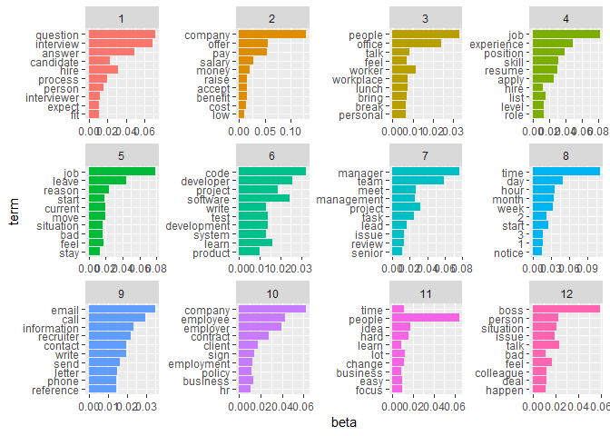

Topic Modelling
================

Data Preprocessing
------------------

In data processing part, we create a sparse matrix using the tidy data method. Stopwords were removed, but stemming and/or lemmatization were not applied as they didn't seem to improve model's performance.

``` r
tidy_allpost <- PostDataframe %>%
  unnest_tokens(word, Body) %>%
  anti_join(stop_words)

tidy_allpost %>%
  count(word, sort = TRUE)
```

    ## # A tibble: 169,511 x 2
    ##    word          n
    ##    <chr>     <int>
    ##  1 company   60115
    ##  2 job       51454
    ##  3 time      49053
    ##  4 people    37469
    ##  5 manager   25332
    ##  6 boss      21921
    ##  7 team      21300
    ##  8 person    18526
    ##  9 interview 16101
    ## 10 position  16071
    ## # ... with 169,501 more rows

``` r
tidy_allpost$word <- lemmatize_words(tidy_allpost$word)

allpost_sparse <- tidy_allpost %>%
  count(Id, word) %>%
  cast_sparse(Id, word, n)
```

Tuning Model
------------

Optimal number of topics was chosen using evaluation of four metrics: "Griffiths2004", "CaoJuan2009", "Arun2010", "Deveaud2014". With more than 70000 posts, fitting model with K value from 2 to 100 took quite some time and the process was actually splited and run many times.

Most metrics suggests the number of topic should be around 10 and 20, always with a tradeoff for each decision. After running different models and evaluate the results, the final model was fitted with K = 12.

Fitting model
-------------

The most challenging part of topic modelling is to analyze the results.

``` r
allposts_lda <- LDA(allpost_sparse, k = 12, method= "Gibbs", control = list(seed = 1234))

allposts_topics <- tidy(allposts_lda, matrix = "beta")

top_terms <- allposts_topics %>%
  group_by(topic) %>%
  top_n(10, beta) %>%
  ungroup() %>%
  arrange(topic, -beta)

top_terms %>%
  mutate(term = reorder(term, beta)) %>%
  ggplot(aes(term, beta, fill = factor(topic))) +
  geom_col(show.legend = FALSE) +
  facet_wrap(~ topic, scales = "free") +
  coord_flip()
```



After qualitative evaluation of each topic, we can pick assuming labels for topics as follows: - Contract and Legal binding (topic 1) - Workplace Etiquette: Leaving time and notice (topics 2) - Interpersonal Relationships: colleague (topic 3) - Work Performance: time management (topic 4), technical knowledge (topic 8), resolve bad performance/ mistakes at work (topic 12) - Job Application Process (topics 5, 6, 9) - Promotion (7, 11)

Topic distribution
------------------

We can see that 12 topics discovered has a similar distribution amonng all post. There was not a significantly prominent topic among them.

``` r
#Distribution of post for each topics
allposts_gamma <- tidy(allposts_lda, matrix = "gamma")

ggplot(allposts_gamma, aes(gamma, fill = as.factor(topic))) +
  geom_histogram(alpha = 0.8, show.legend = FALSE) +
  facet_wrap(~ topic, ncol = 3) +
  labs(title = "Distribution of posts probabilities for each topic",
       y = "Number of posts", x = expression(gamma))
```


